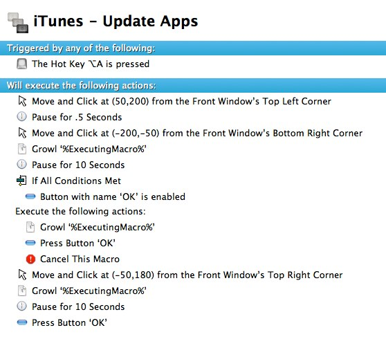
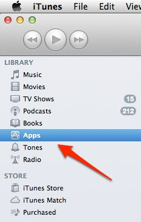
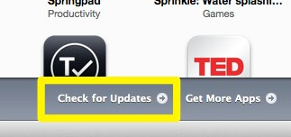

km-itunes-update-apps - a Keyboard Maestro macro to update iOS apps using iTunes
=====================

For years, iTunes has been able to update podcasts using AppleScript:

	tell application "iTunes"
		activate
		updateAllPodcasts
	end tell

but there's no comparable way to update your iOS apps.

Until now.

[iTunes-Update-Apps.kmmacros] is a [Keyboard Maestro] macro designed to do just that.

***Please note: this macro is designed to work with iTunes 10. If you use iTunes 11 with a sidebar, you can probably adapt it to make it work there. I still prefer 10 so I'm sticking with it. If someone makes a fork of this on Github which works with iTunes 11 I'll gladly link it up.***

Here's what it looks like, and then I'll explain what each step does:

* **Triggered by pressing ⌥ + A** (I had a a Keyboard Maestro folder/group which is only active when iTunes is the active app, and this macro is in that group.

* **Move and Click at (50,200) from the Front Window’s Top Left Corner** - that should select 'Apps' under "Library" as shown here:

* **Pause for .5 Seconds** - give iTunes a chance to update what's selected and shown in the main iTunes window.

* **Move and Click at (-200,-50) from the Front Window’s Bottom Right Corner** - aka click on "Check for Updates" near the bottom-right of iTunes' window, as shown here:

* **Growl ‘%ExecutingMacro%’ & Pause for 10 Seconds** - "Check for Updates" needs some time to check to see if any of your apps need updating. So we wait, and use Growl to tell the user we are waiting.

* **If All Conditions Met:**
	* **Button with name ‘OK’ is enabled**
		* **Execute the following actions:**
			* 	**Growl ‘%ExecutingMacro%’**
			* 	**Press Button ‘OK’**
			* 	**Cancel This Macro**

If, after 10 seconds, a button exists with the value "OK" then iTunes has told you that none of your apps need to be updated. In that case, tell the user we are canceling, press the OK button to make the window go away, and then cancel this macro.

*Otherwise:*

* **Move and Click at (-50,180) from the Front Window’s Top Right Corner**
	* Growl ‘%ExecutingMacro%’
	* Pause for 10 Seconds
	* Press Button ‘OK’

That will move click the "Update All Apps" button near the top right corner of your iTunes window, and then sleep for 10 seconds waiting for iTunes to tell you that one of your apps is 17+ and making you press OK to download it.

We press the button (which may or may not exist, but we don't care because if it doesn't exist, it means there is no button to press and we are done anyway. I suppose I ought to put a conditional ("if") there but I didn't bother.

[Keyboard Maestro]: http://www.keyboardmaestro.com/main/

[iTunes-Update-Apps.kmmacros]: iTunes-Update-Apps.kmmacros

